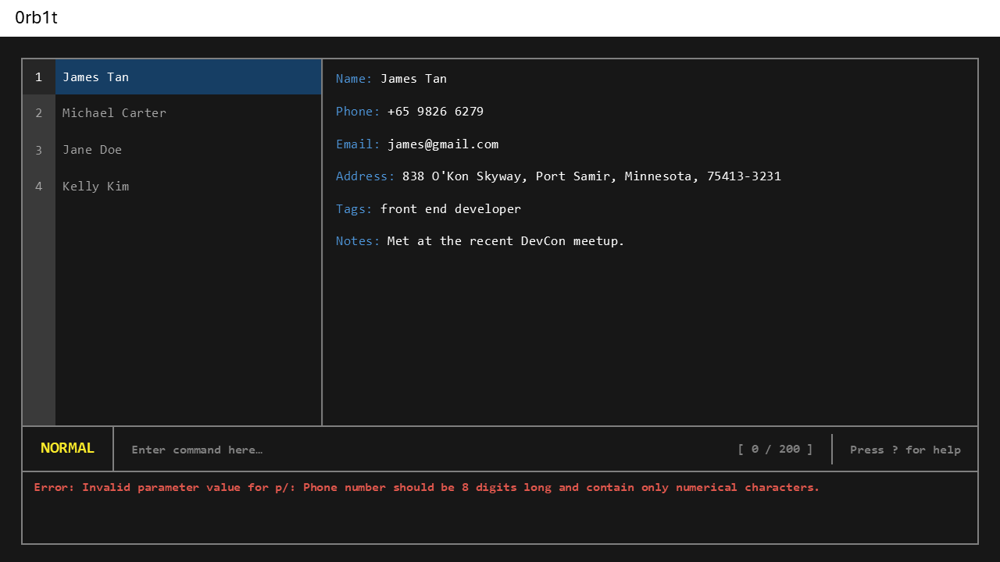

# 0rb1t User guide

**0rb1t** is a desktop application designed for developers who prefer keyboard-driven workflows.

- It brings a **Vim-inspired interface** to contact and task management, so you never have to reach for the mouse.
- Built for developers who feel at home in Vim: 0rb1t lets you navigate, edit, and manage with the keybindings you already know.

The app is **written in OOP fashion**, based on a ~6 KLoC codebase with solid user and developer documentation.

For detailed documentation, see the [**0rb1t Product Website**](https://ay2526s2-cs2103t-t15-4.github.io/tp/).

This project is based on the AddressBook-Level3 project created by the [SE-EDU initiative](https://se-education.org/).




# Table of Contents

- [Command List](#command-list)
    - [Adding Contacts](#adding-contacts)
    - [Clearing the Address Book](#clearing-the-address-book)
    - [Deleting Contacts](#deleting-contacts)
    - [Editing Contacts](#editing-contacts)
    - [Exiting 0rb1t](#exiting-0rb1t)
    - [Finding Contacts](#finding-contacts)
    - [Accessing help in 0rb1t](#accessing-help-in-0rb1t)
    - [Listing Contacts](#listing-contacts)
    - [Listing Tags](#listing-tags)
    - [Viewing Contacts](#viewing-contacts)
- [Storage](#storage)
    - [Saving the data](#saving-the-data)
    - [Editing the data file](#editing-the-data-file)
- [Tips and Examples](#tips-and-examples)
- [Frequently Asked Questions (FAQ)](#frequently-asked-questions-faq)
- [Known Issues](#known-issues)
- [Command Summary](#command-summary)

## Quick Start

Follow these steps to get 0rb1t running on your computer:

1. **Ensure you have Java 17 or above installed.**
    - **Mac users:** Make sure you have the exact JDK version required.
2. **Download the latest `.jar` file** from [here](https://github.com/Jaepple/ip/releases/tag/A-Release).

   *(Replace `#` with the actual download link.)*

3. **Copy the `.jar` file** to the folder you want to use as the home folder for 0rb1t.
4. **Open a terminal** and navigate to the folder containing the `.jar` file.
5. **Run the application** using the following command:

```
java -jar 0rb1t.jar
```

---

## Command List

### Adding Contacts

To add a contact, simply type `:add` followed by the details of the contact you wish to add. The parameters required are:

- The person’s name, typed after `n/`.
- The person’s phone number, typed after `p/`.
- The person’s email, typed after `e/`.
- The person’s house address, typed after `a/`.
- Any tags you wish to identify the person with, typed after `t/`, and each additional tag after the first one separated by `t/`.

Note: All parameters are required except for tags. A person can have any number of tags (including 0).

Format: `:add n/NAME p/PHONE e/EMAIL a/ADDRESS [t/TAG]...`

Examples:

`:add n/John Doe p/98765432 e/johnd@example.com a/John street, block 123, #01-01`

`:add n/Betsy Crowe t/friend e/betsycrowe@example.com a/Newgate Prison p/1234567 t/criminal`

Expected: The new contact will be added to the address book, and it can be viewed at the bottom of the sidebar.

### Clearing the Address Book

To clear the entire address book, type `:clear`. 0rb1t will ask you whether or not you wish to clear the entire address book (in case you mistyped). Typing `yes` will clear the address book, while typing anything else will cancel the command.

Format: `:clear` + `yes`

Example:

`:clear`

Are you sure you want to clear the entire address book?
Type 'yes' to confirm. Any other input will be taken as no.

`yes`

Expected: The entire address book will be cleared, and the sidebar will become empty. 0rbit confirms that the new contact is added, and shows the details of the contact added.

### Deleting Contacts

To delete a contact, type `:delete` followed by the index of the contact you wish to delete. The index of each individual contact can be found at the sidebar.

Format: `:delete <INDEX>` + `yes`

Example:

`:delete 1`

Are you sure you want to delete this person?
<Contact details>
Type 'yes' to confirm. Any other input will be taken as no.

`yes`

Expected: The contact that corresponds to the index entered will be deleted from the address book. 0rb1t confirms that the chosen contact is deleted, and shows the details of the contact deleted.

### Editing Contacts

To edit the details of a contact, type `:edit` followed by the field you wish to edit and the new details. To refresh, the fields that can be edited are:

- The person’s name, typed after `n/`.
- The person’s phone number, typed after `p/`.
- The person’s email, typed after `e/`.
- The person’s house address, typed after `a/`.
- Any tags you wish to identify the person with, typed after `t/`, and each additional tag after the first one separated by `t/`.

Note: If you wish to leave some fields unchanged, you do not have to include them in the `:edit` command.

Format: `:edit n/NAME p/PHONE e/EMAIL a/ADDRESS [t/TAG]...`

Examples:

`:edit 2 n/Adam Wong a/NUS PGP`

`:edit 5 p/13572468 t/school t/friend`

Expected:

0rb1t confirms the updating of details of the chosen contact, and shows the new details of the contact.

### Exiting 0rb1t

To exit the application, type `:exit` and the application will automatically close.

Format: `:exit`

Expected: 0rb1t will close. No goodbye message is shown.

### Finding Contacts

To find a particular contact by their name, type `:find` followed by the name of the contact. To search for multiple people, type each of their names one after another, separated by a space.

Format: `:find <NAME>`

Examples:

`:find bernice`

`:find david`

Expected: 0rb1t will list all the corresponding contacts with the exact name in the sidebar. It will also show how many contacts it listed.

### Accessing Help in 0rb1t

To find help content for using this application, type `:help`.

Format: `:help`

Expected: 0rb1t will open a separate help window, showing the link to the User Guide of 0rb1t.

### Listing Contacts

To list all contacts stored in 0rb1t, type `:list` and all contacts will appear on the sidebar on the left. You can also use this command to filter contacts by 1 or more tags.

Note: If no tags are specified, all contacts are shown. If one or more tags are specified, only persons with at least one of the given tags are shown. Tag-matching is case-insensitive.

Format: `:list <TAG>`

Examples:

`:list`

`:list t/friend`

`:list t/friend t/colleague`

Expected: 0rb1t will state that it listed all persons, and the entire contact list will be made available in the sidebar. If tags are added, all persons with the relevant tags will be made available in the sidebar.

### Listing Tags

To display all the tags that you have added in the address book, type `:tags` and all the tags you have added will be shown, with each tag separated by a comma.

Note: Tags are displayed in alphabetical order, and each tag is shown only once even if multiple contacts have the same tag. Tags are also case-sensitive: “friend” and “Friend” are treated as different tags)

Format: `:tags`

Expected: 0rb1t will state all the tags that have been added to the address book.

### Viewing Contacts

To view the details of a contact, type `:view` followed by the index of the contact you wish to view.

Format: `:view <INDEX>`

Examples:

`:view 2`

`:view 10`

Expected: 0rb1t will state which contact is being shown by stating the name of the contact. The corresponding contact will be highlighted in the sidebar, and the contact details can be viewed in the main window.

## Storage

### Saving the data

All data in 0rb1t is saved in the hard disk automatically after any command that changes the data. There is no need to save manually.

### Editing the data file

All data is saved automatically as a JSON file [JAR file location]/data/0rb1t.json. 
Advanced users are welcome to update data directly by editing that data file.

Caution: If your changes to the data file makes its format invalid, 0rb1t will discard all data and start with an empty data file at the next run. Hence, it is recommended to take a backup of the file before editing it.
Furthermore, certain edits can cause 0rb1t to behave in unexpected ways (e.g., if a value entered is outside the acceptable range). Therefore, edit the data file only if you are confident that you can update it correctly.

## Tips and Examples

- Use `:find` to search for the right person before any other action to avoid changing/deleting the wrong contact.

- Example:
`:find adam`
`:edit 1 p/12345678`
`:delete 1`

## Frequently Asked Questions (FAQ)

**Q**: How do I transfer my data to another Computer?

**A**: Install the app in the other computer and overwrite the empty data file it creates with the file that contains the data of your previous AddressBook home folder.

## Known Issues

1. **When using multiple screens**, if you move the application to a secondary screen, and later switch to using only the primary screen, the GUI will open off-screen. The remedy is to delete the `preferences.json` file created by the application before running the application again.
2. **If you minimise the Help Window** and then run the `help` command (or use the `Help` menu, or the keyboard shortcut `F1`) again, the original Help Window will remain minimised, and no new Help Window will appear. The remedy is to manually restore the minimised Help Window.

## Command Summary

| Command       | Format                                             | Description                                                      | Example                                                                                              |
|---------------|----------------------------------------------------|------------------------------------------------------------------|------------------------------------------------------------------------------------------------------|
| Add           | `:add n/NAME p/PHONE e/EMAIL a/ADDRESS [t/TAG]...` | Adds a person to the address book.                               | `:add n/John Doe p/98765432 e/johnd@example.com a/311, Clementi Ave 2, #02-25 t/friends t/owesMoney` |
| Clear         | `:clear`  + `yes`                                  | Clears the entire address book.                                  | `:clear`<br/>`...`<br/>`yes`                                                                         |
| Delete        | `:delete <INDEX>` + `yes`                          | Deletes a person from the address book.                          | `:delete 2`<br/>`...`<br/>`yes`                                                                      |
| Edit          | `:edit <INDEX>`                                    | Edits a person’s details in the address book.                    | `:edit 3`                                                                                            |
| Exit          | `:exit`                                            | Exit 0rb1t.                                                      | `:exit`                                                                                              |
| Find          | `:find <NAME>`                                     | Finds a person in the address book based on their name.          | `:find John`                                                                                         |
| Help          | `:help`                                            | Opens the help page.                                             | `:help`                                                                                              |
| List Contacts | `:list <TAG>`                                      | Lists all contacts stored in the address book.                   | `:list`<br/>`:list t/friend`                                                                         |
| List Tags     | `:tags`                                            | Lists all the tags used in the address book.                     | `:tags`                                                                                              |
| View          | `:view <INDEX>`                                    | Views a person’s details in the address book based on the index. | `:view 4`                                                                                            |
